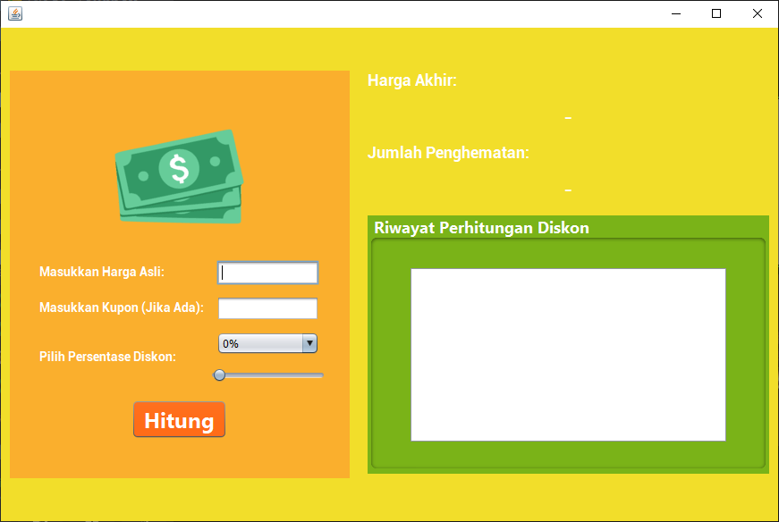
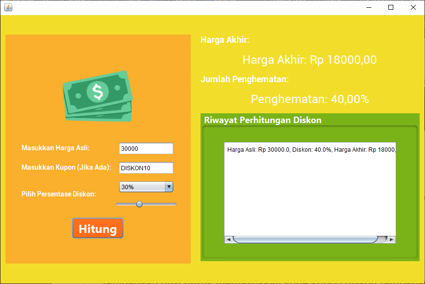

# Aplikasi Perhitungan Diskon

Aplikasi Perhitungan Diskon adalah aplikasi sederhana berbasis Java Swing yang memungkinkan pengguna untuk menghitung harga akhir setelah menerapkan diskon. Aplikasi ini juga dapat menerima kode kupon diskon tambahan dan menyimpan riwayat perhitungan diskon sebelumnya.

## Fitur Aplikasi

- **Input Harga Asli**: Pengguna dapat memasukkan harga asli barang.
- **Pilihan Persentase Diskon**: Pengguna dapat memilih persentase diskon menggunakan `JComboBox` atau `JSlider`.
- **Kode Kupon Diskon**: Aplikasi mendukung kode kupon tambahan (misalnya, "DISKON10" untuk diskon 10% tambahan).
- **Tombol Hitung Diskon**: Menghitung harga akhir setelah diskon dan menampilkan hasilnya.
- **Output Harga Akhir dan Penghematan**: Menampilkan harga akhir dan persentase penghematan yang didapat.
- **Riwayat Perhitungan Diskon**: Menyimpan riwayat perhitungan yang telah dilakukan oleh pengguna.

## Tampilan Antarmuka
- ### tampilan awal program
  
- ### menjalankan menginputkan harga dll, melakukan proses hitung dan menampilkan outputnya
  

Antarmuka aplikasi terdiri dari:
- `JTextField` untuk memasukkan harga asli dan kode kupon diskon.
- `JComboBox` untuk memilih persentase diskon.
- `JSlider` sebagai alternatif untuk memilih persentase diskon.
- `JButton` untuk menghitung diskon.
- `JLabel` untuk menampilkan harga akhir setelah diskon dan jumlah penghematan dalam bentuk persentase.
- `JTextArea` untuk menampilkan riwayat perhitungan diskon.

## Cara Penggunaan

1. Masukkan **harga asli** barang pada `JTextField` harga asli.
2. Pilih persentase diskon menggunakan `JComboBox` atau `JSlider`.
3. (Opsional) Masukkan **kode kupon diskon** jika tersedia. Misalnya, masukkan kode "DISKON10" untuk diskon tambahan sebesar 10%.
4. Klik tombol **Hitung** untuk mendapatkan harga akhir setelah diskon dan jumlah penghematan.
5. Hasil akan ditampilkan di `JLabel` untuk harga akhir dan penghematan.
6. Riwayat perhitungan diskon sebelumnya akan ditampilkan di `JTextArea`.

## Validasi Input

- Aplikasi memiliki mekanisme **exception handling** yang memastikan bahwa input pada harga asli adalah angka valid. Jika input salah, pengguna akan mendapatkan pesan kesalahan.

## Teknologi yang Digunakan

- **Java** sebagai bahasa pemrograman utama.
- **Java Swing** untuk antarmuka grafis.

## Instalasi dan Menjalankan Aplikasi

1. **Clone** atau **download** proyek ini ke komputer Anda.
2. Buka proyek di **NetBeans** atau IDE Java lain yang mendukung Java Swing.
3. Jalankan file `DiskonFrame.java` sebagai aplikasi utama.

## Contoh Kasus Penggunaan

Misalnya, jika harga asli barang adalah Rp100,000, pengguna memilih diskon 20%, dan memasukkan kode kupon "DISKON10", aplikasi akan:
- Menghitung total diskon sebagai 30% (20% dari pilihan + 10% dari kupon).
- Menampilkan harga akhir setelah diskon dan persentase penghematan di label yang sesuai.
- Menambahkan catatan perhitungan ke dalam riwayat di `JTextArea`.

## Kontribusi

Jika ingin berkontribusi, silakan buat pull request atau ajukan issue di repository ini.

---

Dibuat dengan Java Swing untuk latihan dan pembelajaran pemrograman GUI dengan Java.
